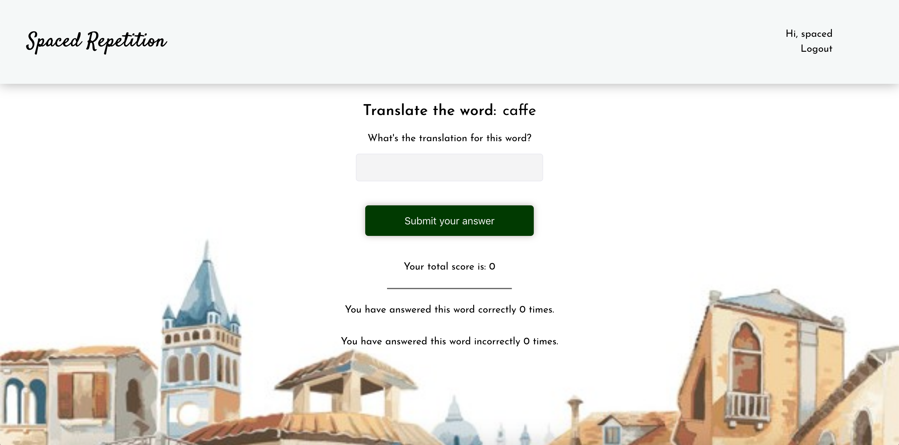

# Spaced repetition API!
Live API Link: 

<https://shrouded-springs-60057.herokuapp.com/>

GitHub Links: 

https://github.com/thinkful-ei-emu/spaced-repetition-MAC-client

https://github.com/thinkful-ei-emu/spaced-repetition-MAC-api


## Application Description 
Spaced Repetition is a responsive web application that allows users to learn a foreign language. The application utilizes an algorithm to implement  the spaced repetition learning technique, which allows for more effective learning of a new language. Our application currently allows users to learn Italian, but is structured for the potential to add additional languages in the future.


### Screenshots




### Tech Stack
- Frontend: JavaScript, React, CSS (flexbox), media queries, 
- Backend: Node.js, Express, Knex, PostgreSQL
- Development/Hosting: Heroku, Ziet, GitHub, Cypress, Mocha

#### Next Steps
- Add additional words to database
- Add options to add additional languages
- Add options to archive word once mastered
- Add features to listen to the pronunciation of words

## Local dev setup

If using user `dunder-mifflin`:

```bash
mv example.env .env
createdb -U dunder-mifflin spaced-repetition
createdb -U dunder-mifflin spaced-repetition-test
```

If your `dunder-mifflin` user has a password be sure to set it in `.env` for all appropriate fields. Or if using a different user, update appropriately.

```bash
npm install
npm run migrate
env MIGRATION_DB_NAME=spaced-repetition-test npm run migrate
```

And `npm test` should work at this point

## Configuring Postgres

For tests involving time to run properly, configure your Postgres database to run in the UTC timezone.

1. Locate the `postgresql.conf` file for your Postgres installation.
   1. E.g. for an OS X, Homebrew install: `/usr/local/var/postgres/postgresql.conf`
   2. E.g. on Windows, _maybe_: `C:\Program Files\PostgreSQL\11.2\data\postgresql.conf`
   3. E.g  on Ubuntu 18.04 probably: '/etc/postgresql/10/main/postgresql.conf'
2. Find the `timezone` line and set it to `UTC`:

```conf
# - Locale and Formatting -

datestyle = 'iso, mdy'
#intervalstyle = 'postgres'
timezone = 'UTC'
#timezone_abbreviations = 'Default'     # Select the set of available time zone
```

## Scripts

Start the application `npm start`

Start nodemon for the application `npm run dev`

Run the tests mode `npm test`

Run the migrations up `npm run migrate`

Run the migrations down `npm run migrate -- 0`
